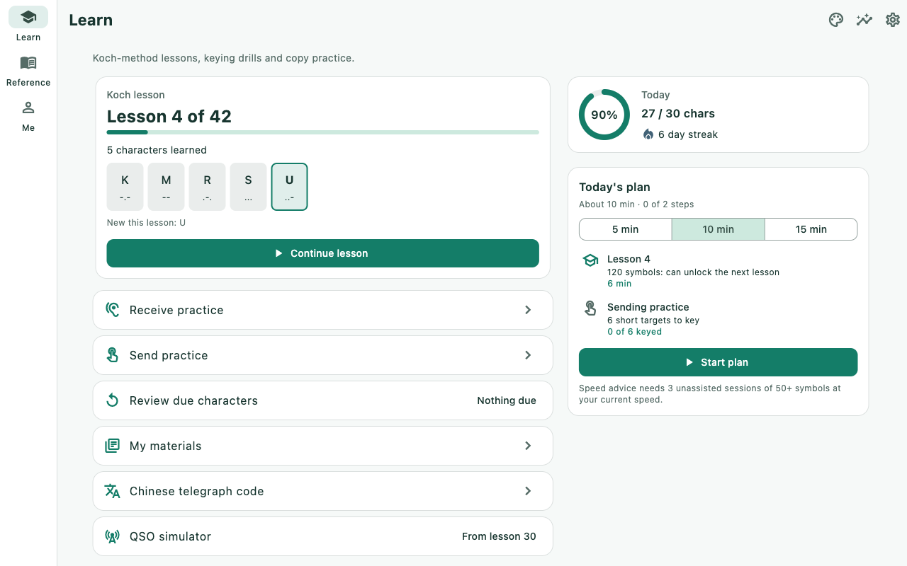
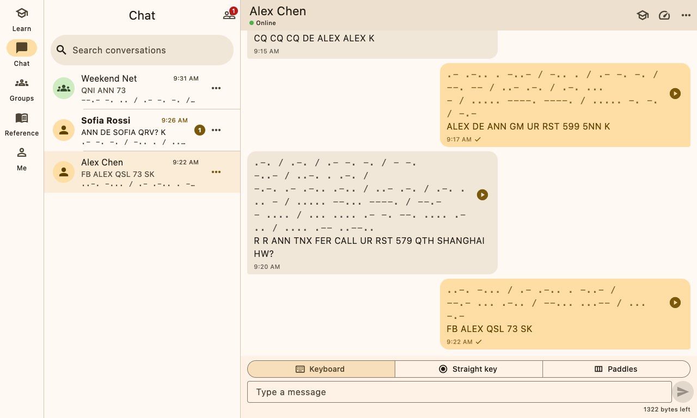
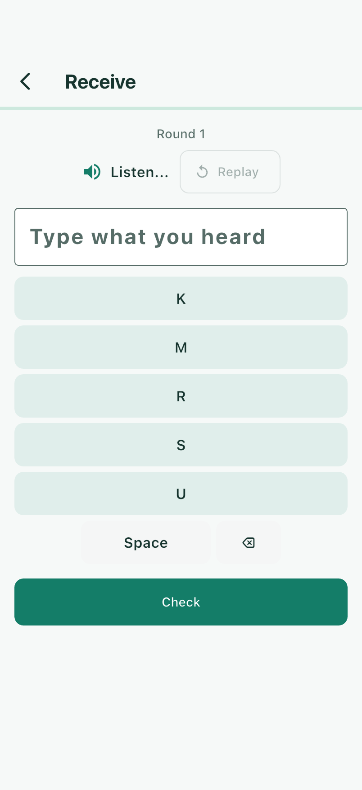
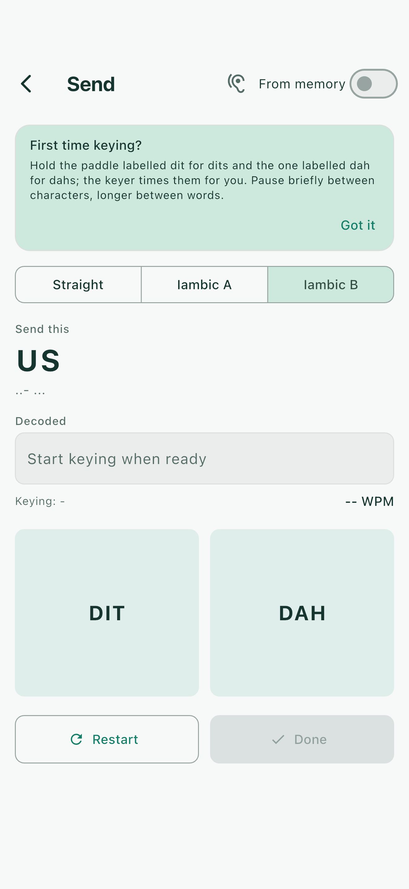
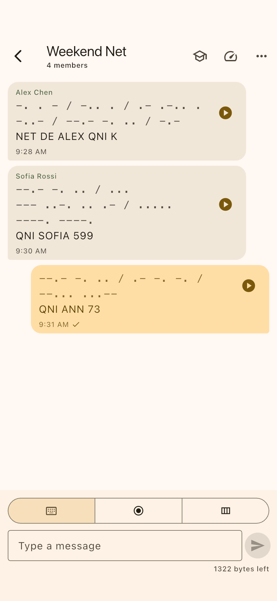
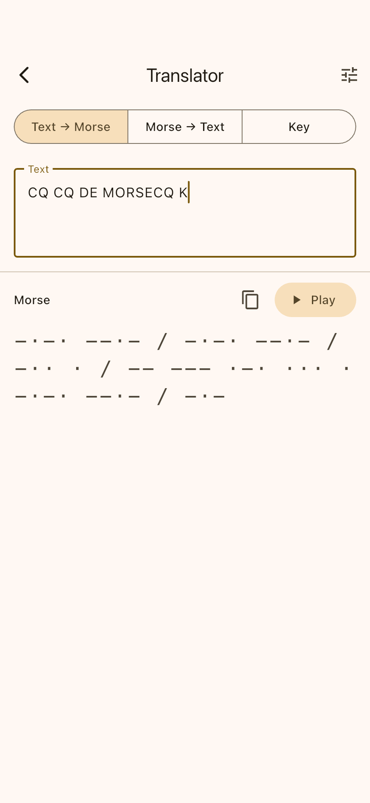

[简体中文](./README.zh-CN.md)

# morsecq

**Talk in Morse code.** morsecq is a Morse code trainer and a serverless,
peer-to-peer Morse chat built on the [Tox](https://tox.chat) network. Learn the
code with structured lessons and keying drills, then key it to real people —
one-to-one or in group nets — with no server in the middle. It speaks the same
Tim2Tox wire protocol as its sibling project **toxee**, so the two interoperate.

## Status

**Pre-alpha.** All planned v1 modules are wired into the app shell and pass the
repository gates (analyzer, complexity, import guard, ARB sync) and the full
test pyramid (unit, widget, and real-UI launch tests on macOS, iOS simulator
and Android emulator; see [doc/testing/TEST_PYRAMID.md](doc/testing/TEST_PYRAMID.md)).
There is no usable release yet. Expect breaking changes everywhere.

## Screenshots

<table>
  <tr>
    <td></td>
    <td></td>
  </tr>
  <tr>
    <td align="center">Learn (macOS)</td>
    <td align="center">A CW QSO (macOS)</td>
  </tr>
</table>

<table>
  <tr>
    <td></td>
    <td></td>
    <td></td>
    <td></td>
  </tr>
  <tr>
    <td align="center">Receive drill</td>
    <td align="center">Send practice</td>
    <td align="center">Group net</td>
    <td align="center">Translator</td>
  </tr>
</table>

Every screen on macOS, Linux, Windows, iPhone, iPad and Android, in English and Chinese: [doc/screenshots/README.md](doc/screenshots/README.md). Frames are generated by `tool/screenshots/capture.sh` from demo data, not edited by hand.

## Features

The app has five destinations — **Learn / Chat / Groups / Reference / Me** —
behind a single startup gate: a Tox identity is created (or unlocked) on first
launch and is required for training as well as chat.

- **Learn** — Koch-method character course with Farnsworth spacing, copy
  drills (character groups, words, callsigns, short QSOs), send practice on an
  on-screen straight key or iambic paddle **and** on the desktop keyboard,
  real-time decoding with rhythm diagnostics, confusion matrix, spaced
  repetition and daily goals. Progress is stored per identity.
- **Listen by microphone** — decode Morse from live audio (`morse_dsp`:
  Goertzel tone detection, auto-tune, envelope gate) with the `record` plugin
  feeding PCM into `AudioMorseDecoder`.
- **Chat** — add friends by Tox ID or QR code; messages travel as plain text so
  any Tim2Tox client (including toxee) can read them, and morsecq replays them
  as dits and dahs at the *listener's* chosen speed. Bubbles show dot/dash
  pattern, plain text and a play button; "listen first, then reveal" training
  mode; keyboard / straight-key / paddle input with pre-listen; offline queue
  with "pending" status while the peer is offline.
- **Groups** — create, invite and join by chat_id (Tox NGC groups), group
  Morse messages, member list, automatic re-join after restart.
- **Reference** — alphabet, punctuation, prosigns, Q-codes and CW
  abbreviations, plus a two-way text ↔ Morse translator that shares the
  playback settings.
- **Me** — identity backup/restore (encrypted `.tox` + QR), training settings,
  statistics (accuracy trends, character grid, confusion heat-map, practice
  calendar), language, notifications and about (shows which backend is live).
- **Notifications** — local notifications for chat events (with a Morse
  pattern), unread badge, foreground/background coordination; iOS declares
  only the `audio` background mode (no ToxAV, so no `voip`).
- **Desktop shell** — window bounds persistence, close-to-tray, tray menu and
  keyboard shortcuts on macOS / Windows / Linux; all no-ops on mobile.
- **Bilingual UI** — English and Simplified Chinese via Flutter gen-l10n
  (`lib/l10n/app_en.arb` / `app_zh.arb`).
- **Appearance** — Classic Brass, Modern Calm, Night Radio, Paper Handbook
  and Fresh Cartoon, with independent System / Light / Dark mode. Choose
  Me → Appearance to preview and apply; preferences survive restart.
  [Approved designs and rendered previews](doc/designs/ui-styles-2026-10-01/README.md).
- **Sound, haptics and light** — `flutter_soloud` sidetone on all five
  platforms, haptics on mobile, screen flash everywhere.

Not in v1 (by design): voice/video calls, server push, multiple accounts
online at once, transmitting the sender's actual keying rhythm (v2, needs
upstream Tim2Tox work).

## Layout

This is a pub workspace (one `dart pub get` at the root resolves everything).

| Path | What |
|------|------|
| `packages/morse_core` | Pure-Dart Morse engine: alphabet, PARIS/Farnsworth timing, encoder, streaming key decoder |
| `packages/morse_trainer` | Pure-Dart pedagogy: Koch lesson progression, scoring, spaced practice |
| `packages/morse_dsp` | Pure-Dart audio decoding: Goertzel tone detection, auto-tune, envelope gate, `AudioMorseDecoder` |
| `packages/morse_io` | Flutter I/O: audio sidetone, haptics, flash, touch + keyboard keying input |
| `packages/morsecq_chat_api` | Pure-Dart contract between UI and backend (`IdentityService`, `ChatService`, models, in-memory fakes) |
| `packages/morsecq_chat` | Tox transport implementing the contract on Tim2Tox (the only package that touches Tim2Tox / the Tencent SDK) |
| `apps/morsecq` | The Flutter app: Material 3, responsive Learn / Chat / Groups / Reference / Me shell, startup gate, notifications, desktop shell, l10n |
| `third_party/tim2tox` | git submodule (upstream `agentx-icu/tim2tox`) — never edited in place |
| `tool/` | Repository gates (500-LOC complexity guard, import/layering guard), dependency bootstrap, native build helpers |
| `doc/` | Documentation tree — see [doc/README.md](doc/README.md) |

## Build prerequisites

- Flutter **3.41.9** stable (Dart 3.11) — the version CI pins.
- Platform toolchains for the targets you build: Xcode (iOS/macOS), Android SDK
  + JDK (Android), GTK 3 dev headers (Linux), Visual Studio C++ workload (Windows).
- For the chat backend: a C/C++ toolchain and CMake ≥ 3.16 to build the
  `libtim2tox_ffi` native library (libsodium is fetched and built statically;
  `--no-toxav` is the default, so opus/vpx are not needed). Without it the app
  falls back to an in-memory fake backend and says so on the About page.

```bash
git clone --recursive https://github.com/agentx-icu/morsecq.git
cd morsecq
dart run tool/bootstrap_deps.dart      # submodules, vendored SDK, patches, pubspec_overrides
dart pub get
flutter analyze apps/morsecq
dart run tool/check_complexity.dart
dart run tool/import_guard.dart
(cd apps/morsecq && flutter test)
(cd apps/morsecq && flutter run)
```

Building and bundling the native library per platform is described in
[doc/operations/BUILD_AND_DEPLOY.md](doc/operations/BUILD_AND_DEPLOY.md).

## Documentation

Every document exists in English (`X.md`, the default that links and CI point
to) and Simplified Chinese (`X.zh-CN.md`). The index is
[doc/README.md](doc/README.md).

Screenshots of every screen, per platform and language, are in
[doc/screenshots/README.md](doc/screenshots/README.md); the test tiers and how
to run them are in [doc/testing/TEST_PYRAMID.md](doc/testing/TEST_PYRAMID.md).

Conventions, gates and the working agreement are in [CLAUDE.md](CLAUDE.md).
The product and architecture plan is
[doc/plans/2026-09-30-morsecq-plan.md](doc/plans/2026-09-30-morsecq-plan.md)
(the Chinese original is
[doc/plans/2026-09-30-morsecq-plan.zh-CN.md](doc/plans/2026-09-30-morsecq-plan.zh-CN.md)).

## Licence

morsecq is free software, released under the **GNU General Public License
v3.0**. See [LICENSE](LICENSE). Copyright the morsecq contributors
(agentx-icu).
