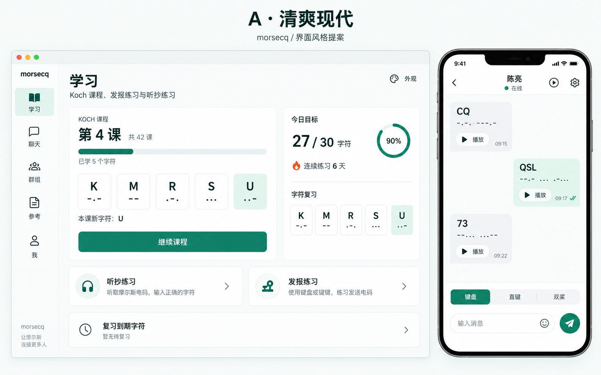
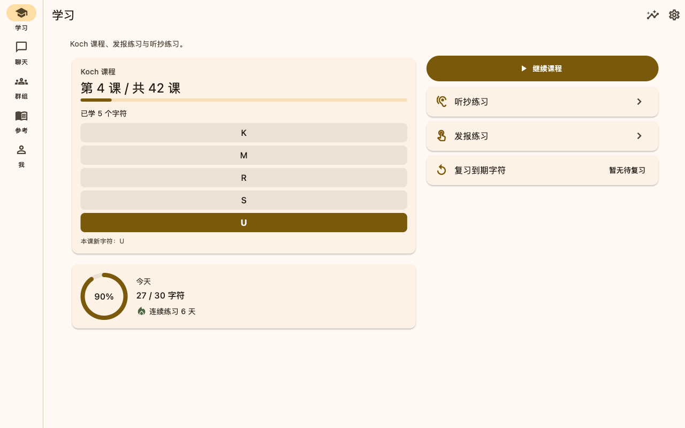
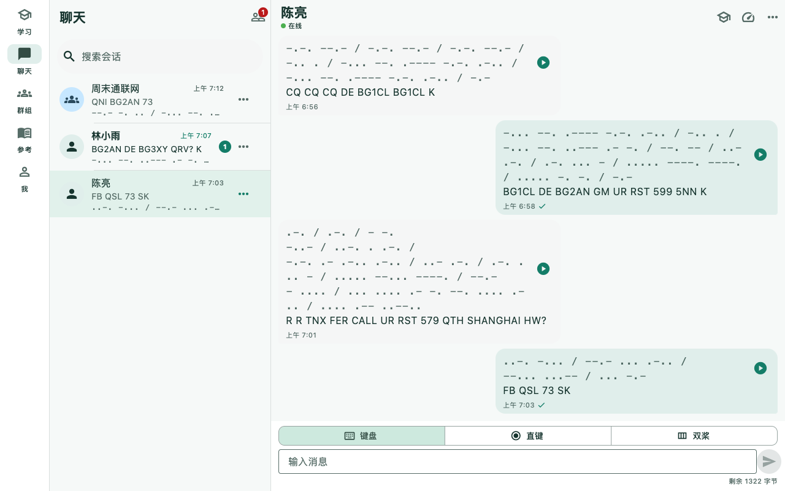
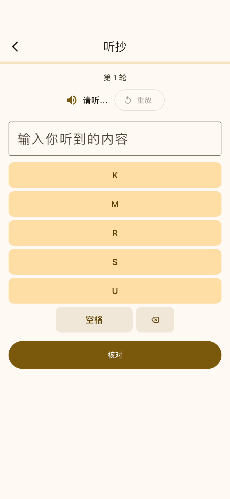
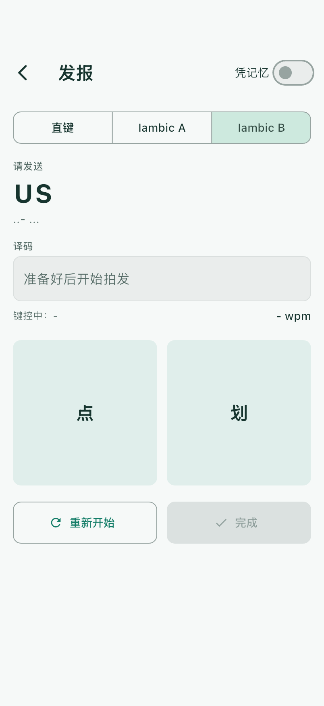
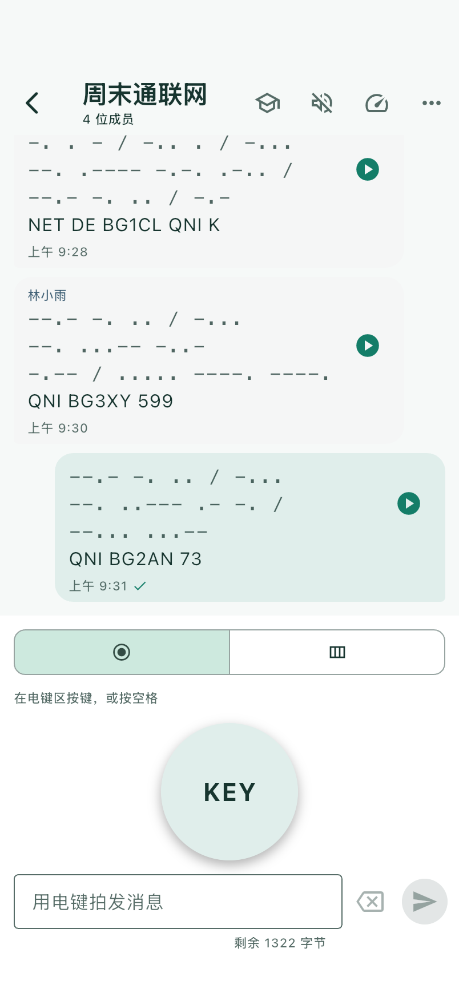
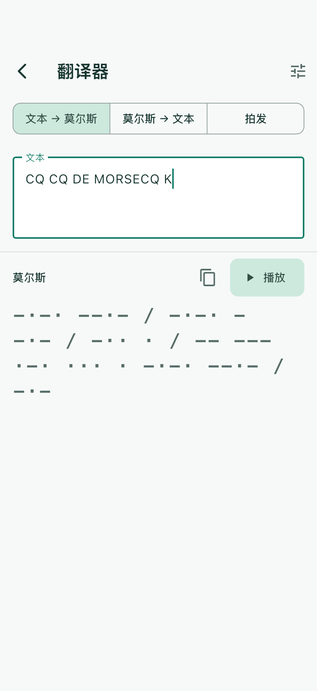

[English](./README.md)

# MorseCQ

**用莫斯电码聊天。** MorseCQ 是一款莫斯电码训练器，同时也是一个建立在
[Tox](https://tox.chat) 网络之上、无服务器的点对点莫斯聊天工具。先通过系统化的
课程与发报练习学会电码，再和真人「敲」着聊——单聊或群组「电台网」都可以，中间
没有任何服务器。它与姊妹项目 **toxee** 使用同一套 Tim2Tox 线路协议，两者可以互通。



*中文版清爽现代设计图，与默认风格和下方截图保持一致。[查看全部风格](doc/designs/ui-styles-2026-10-01/README.zh-CN.md)。*

## 状态

**Pre-alpha。** v1 规划的全部模块已接入 App 外壳，通过仓库门禁（analyzer、复杂度、
import guard、UI 字面量守卫）和完整的测试金字塔（单元、控件，以及 macOS、iOS 模拟器、Android
模拟器上的真实 UI 启动测试；见 [doc/testing/TEST_PYRAMID.zh-CN.md](doc/testing/TEST_PYRAMID.zh-CN.md)）。
尚无可用的发布版本，任何地方都可能发生破坏性变更。

## 截图

<table>
  <tr>
    <td></td>
    <td></td>
  </tr>
  <tr>
    <td align="center">学习（macOS）</td>
    <td align="center">一次 CW 通联（macOS）</td>
  </tr>
</table>

<table>
  <tr>
    <td></td>
    <td></td>
    <td></td>
    <td></td>
  </tr>
  <tr>
    <td align="center">抄收练习</td>
    <td align="center">发报练习</td>
    <td align="center">群通联</td>
    <td align="center">翻译器</td>
  </tr>
</table>

macOS、Linux、Windows、iPhone、iPad、Android 上中英文的全部界面见 [doc/screenshots/README.zh-CN.md](doc/screenshots/README.zh-CN.md)。截图由 `tool/screenshots/capture.sh` 用演示数据自动生成，未经手工修改。

## 功能

App 有五个目的地——**Learn（学习）/ Chat（聊天）/ Groups（群组）/ Reference（手册）/
Me（我）**——全部位于同一个启动门之后：首次启动时创建（或解锁）一个 Tox 身份用于聊天。
**先试试学习** 会在独立的本地访客档案上运行学习、手册与工具；之后新建身份时访客进度会转移过去
（恢复或解锁的身份保留自己的进度，除非你选择改用访客进度）。

- **学习** —— Koch 法字符课程 + Farnsworth 间距；听抄练习（字符组、单字速认、常用词、
  缩语与 Q 简语、数字组、呼号、易混字符、简短 QSO、竞赛交换）；发报练习支持屏幕直键 / 双桨自动键 **以及** 桌面键盘；实时解码并给出
  节奏诊断；错字混淆矩阵；间隔复习与每日目标。进度按身份（或访客）保存。
  **今日计划**（5/10/15 分钟：复习、重点练习、课程、发报），以及基于证据、点「应用」前不改动
  任何设置的速度建议；交互式 **QSO 模拟**（回应 CQ 或呼叫 CQ，按字段检查拍发的回复，支持 AGN/QRS）；
  发报 **节奏时间轴**，可回放与针对性练习；可跳过的 **水平测试**；**我的素材**（自有文本、词表、
  呼号；TXT/JSON 导入导出；16 位 WAV 导出）。
- **无线电工具** —— 从手册页进入：梅登黑德网格定位（含距离与天线方位）、按 IARU
  分区的频段边界与波长 / 天线长度、报速换算、RST 报告、UTC 时钟（`radio_tools`，纯 Dart）。
- **麦克风听抄** —— 从实时音频中解码莫斯（`morse_dsp`：Goertzel 音调检测、自动
  调谐、包络门限），由 `record` 插件把 PCM 送入 `AudioMorseDecoder`。**录音工作台** 可导入
  WAV（PCM16、8–48 kHz、单 / 双声道），循环选段、解码，或自己抄收并评分。
- **聊天** —— 通过 Tox ID 或二维码加好友；消息在线路上就是纯文本，任何 Tim2Tox
  客户端（含 toxee）都能读，MorseCQ 收到后按**听者**自选速度重新播成「滴答」。气泡
  显示点划符号 / 明文 / 播放按钮；「先听后揭晓」训练模式；用直键或双桨拍发（触屏，桌面端也可用
  键盘按键）到只读草稿，并可发送前预听；对方离线时消息进入离线队列并显示「待送达」。收到的
  消息可作为抄收练习或保存为训练素材；纯听模式同时隐藏明文和点划。支持历史消息搜索与筛选、
  跳转到结果、本地收藏、取消仍在本机排队的发送、重试失败的发送（同一条消息，不产生重复气泡）。
- **群组** —— 创建 / 邀请 / 通过 chat_id 加入（Tox NGC 群），群内莫斯消息，成员
  列表，重启后自动重入。
- **手册** —— 字母表、标点、prosign、Q 简语与 CW 缩写；双向文本 ↔ 莫斯翻译器，
  与播放设置共享。
- **我** —— 身份备份 / 恢复（加密 `.tox` + 二维码）、训练设置、统计（准确率趋势、
  字符格、混淆热图、练习日历）、语言、通知、关于页（显示当前使用的后端）。
- **通知** —— 聊天事件的本地通知（含莫斯图样）、未读角标、前后台协调；iOS 不声明
  后台模式（后台不播放声音；不带 ToxAV，因此没有 `voip`），后台刷新在 `beginBackgroundTask` 下完成。
- **桌面外壳** —— macOS / Windows / Linux 上的窗口尺寸持久化、关闭到托盘、托盘菜单
  与快捷键；移动端全部为 no-op。
- **多语言界面** —— 通过 Flutter gen-l10n 提供英文、简体中文、繁体中文、日语、
  韩语、德语、法语、西班牙语、葡萄牙语和俄语（`lib/l10n/app_*.arb`）。
  在「我 → 语言」中选择，或跟随系统。文档只维护英文和简体中文。
- **外观** —— 经典黄铜、清爽现代、夜航电台、纸感手册、清新卡通五套风格，独立选择
  跟随系统 / 浅色 / 深色。默认使用清爽现代，已有保存的风格选择继续保留。
  通过「我 → 外观」预览后应用，重启后保留选择。
  [已确认设计图与实际界面预览](doc/designs/ui-styles-2026-10-01/README.zh-CN.md)。
- **声音、触觉与闪光** —— 五端统一使用 `flutter_soloud` 侧音，移动端触觉反馈，
  全平台屏幕闪光。

v1 明确不做：语音 / 视频通话、服务器推送、多账号同时在线、传输发送方真实键控节奏
（v2，依赖 Tim2Tox 上游改动）。

## 目录结构

本仓库是一个 pub workspace（在根目录执行一次 `dart pub get` 即可解析全部依赖）。

| 路径 | 内容 |
|------|------|
| `packages/morse_core` | 纯 Dart 莫斯引擎：字母表、PARIS/Farnsworth 时序、编码器、流式按键解码器 |
| `packages/morse_trainer` | 纯 Dart 教学法：Koch 课程进度、评分、间隔复习 |
| `packages/morse_dsp` | 纯 Dart 音频解码：Goertzel 音调检测、自动调谐、包络门限、`AudioMorseDecoder` |
| `packages/radio_tools` | 纯 Dart 业余无线电计算：梅登黑德网格、大圆距离与方位、IARU 频段边界、报速、RST |
| `packages/morse_io` | Flutter I/O：侧音、触觉、闪光、触屏 + 键盘键控输入 |
| `packages/morsecq_chat_api` | UI 与后端之间的纯 Dart 契约（`IdentityService`、`ChatService`、模型、内存假实现） |
| `packages/morsecq_chat` | 在 Tim2Tox 上实现契约的 Tox 传输层（唯一允许接触 Tim2Tox / 腾讯 SDK 的包） |
| `apps/morsecq` | Flutter App：Material 3、响应式 Learn / Chat / Groups / Reference / Me 外壳、启动门、通知、桌面外壳、l10n |
| `third_party/tim2tox` | git 子模块（上游 `agentx-icu/tim2tox`）——永不原地修改 |
| `tool/` | 仓库门禁（500 行复杂度守卫、import 分层守卫、本地化用的 UI 字面量守卫）、依赖引导、原生构建辅助脚本 |
| `doc/` | 文档树——见 [doc/README.zh-CN.md](doc/README.zh-CN.md) |

## 构建前提

- Flutter **3.41.9** stable（Dart 3.11）——与 CI 相同的 pin。
- 目标平台工具链：Xcode（iOS/macOS）、Android SDK + JDK（Android）、GTK 3 开发头文件
  （Linux）、Visual Studio C++ 工作负载（Windows）。
- 聊天后端需要 C/C++ 工具链与 CMake ≥ 3.16 来构建 `libtim2tox_ffi` 原生库
  （libsodium 自动下载并静态构建；默认 `--no-toxav`，不需要 opus/vpx）。没有原生库时
  App 会回落到内存假后端，并在「关于」页标明。

```bash
git clone --recursive https://github.com/agentx-icu/morsecq.git
cd morsecq
dart run tool/bootstrap_deps.dart      # 子模块、vendored SDK、补丁、pubspec_overrides
dart pub get
flutter analyze apps/morsecq
dart run tool/check_complexity.dart
dart run tool/import_guard.dart
dart run tool/ui_literal_guard.dart
(cd apps/morsecq && flutter test)
(cd apps/morsecq && flutter run)
```

各平台原生库的构建与捆绑见
[doc/operations/BUILD_AND_DEPLOY.zh-CN.md](doc/operations/BUILD_AND_DEPLOY.zh-CN.md)。

## 文档

每份文档都有英文版（`X.md`，链接与 CI 指向的默认版本）和简体中文版（`X.zh-CN.md`）。
索引见 [doc/README.zh-CN.md](doc/README.zh-CN.md)。

各平台、各语言的全部界面截图见 [doc/screenshots/README.zh-CN.md](doc/screenshots/README.zh-CN.md)；
测试分层与运行方法见 [doc/testing/TEST_PYRAMID.zh-CN.md](doc/testing/TEST_PYRAMID.zh-CN.md)。

约定、门禁与工作约定见 [CLAUDE.md](CLAUDE.md)。产品与架构规划见
[doc/plans/2026-09-30-morsecq-plan.zh-CN.md](doc/plans/2026-09-30-morsecq-plan.zh-CN.md)
（中文为原稿；英文版为
[doc/plans/2026-09-30-morsecq-plan.md](doc/plans/2026-09-30-morsecq-plan.md)）。

## 许可证

MorseCQ 是自由软件，以 **GNU General Public License v3.0** 发布。见
[LICENSE](LICENSE)。版权归 MorseCQ 贡献者（agentx-icu）所有。
