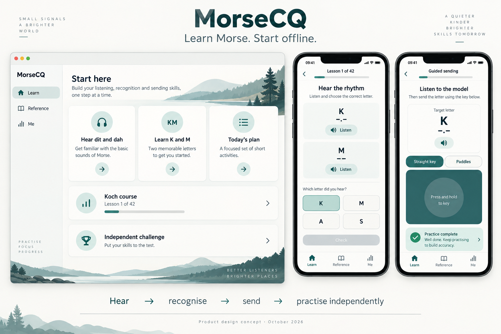

# MorseCQ

[English](README.md)

MorseCQ 是无需账号的离线莫尔斯电码学习软件，安装后即可开始学习。聊天功能已迁移到独立应用 [DitMesh](https://github.com/agentx-icu/ditmesh)。

保留科赫课程、水平测评、间隔复习、抄报练习、直键与双桨发报练习、模拟无线电通联、学习素材、统计、参考手册、翻译器、中文电报码、麦克风解码、录音抄报工作台和业余无线电工具。手机、平板和桌面支持触摸与实体键盘操作，提供十种界面语言和五种视觉样式。

导航统一为 **学习 / 参考 / 我的**。不包含注册、Tox 身份、聊天 SDK、联系人、群组、聊天通知或聊天网络服务。仅实时音频解码申请麦克风权限；文件选择与分享用于本地学习素材。



[当前产品设计](doc/designs/product-2026-10-08/README.zh-CN.md)描述应用拆分后的职责。真实截图由[截图流程](tool/screenshots/README.zh-CN.md)生成，见[截图说明](doc/screenshots/README.zh-CN.md)。设计概念图与真实运行截图分开标注。

## 运行与验证

使用 Flutter **3.41.9** / Dart **3.11.5**，并安装目标平台常规 Flutter 构建工具。在仓库根目录统一解析 Pub workspace：

```sh
dart pub get
cd apps/morsecq
flutter run -d macos
```

无需检出子模块、执行聊天依赖引导、编译 Tox 原生库、传入后端开关或创建账号。

```sh
# 在仓库根目录执行
bash tool/test_pyramid.sh --level gates
bash tool/test_pyramid.sh --level unit
bash tool/test_pyramid.sh --level widget
./build_all.sh --platform macos --mode release
bash tool/ci/package_artifacts.sh --target macos
```

Android、iOS、macOS、Linux 和 Windows 均为必需发布目标。[构建与发布说明](doc/operations/BUILD_AND_DEPLOY.zh-CN.md)涵盖 CI、安装包、签名及草稿 GitHub Release。

## 本地学习数据

学习数据保存在本机 `<应用支持目录>/morsecq/guest/`：`training/` 保存进度、设置与学习文档，`media/recordings/` 保存托管录音；应用偏好位于 `settings.json`。“我的”中的清除操作在确认后写入待保存数据，再删除当前学习数据。Android 平台备份关闭，卸载可能删除本地数据。

## 仓库结构

- `packages/morse_core`：纯 Dart 字母表、时序、编码解码与中文电报码。
- `packages/morse_trainer`：课程、测评、间隔复习、评分与模拟通联。
- `packages/morse_dsp`：纯 Dart 音频解码与 WAV 读取。
- `packages/radio_tools`：网格、距离、波段、CW 速度与 RST 工具。
- `packages/morse_io`：Flutter 音频、键控与触觉反馈。
- `apps/morsecq`：离线应用、本地持久化与桌面窗口服务。

[本地学习架构](doc/architecture/OFFLINE_LEARNING.md) · [测试](doc/testing/TEST_PYRAMID.zh-CN.md) · [验证记录](doc/VALIDATION.zh-CN.md) · [隐私](site/zh-CN/privacy.md) · [支持](site/zh-CN/support.md) · [许可证](LICENSE)
