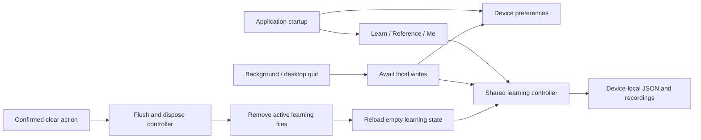

# Offline learning architecture

The Flutter shell opens Learn directly and exposes Learn / Reference / Me on every platform. AppScope creates device-local preferences, language, key profiles, audio/reference settings and one TrainingControllerHost. No account or transport is initialized.

The host shares one controller between learning, training settings, statistics and audio workbench. Learning files are atomic JSON stores under `morsecq/guest/training/`, with previous-save fallback. Managed recordings live under `morsecq/guest/media/recordings/`. App-wide appearance, language, decoder and reference settings remain in `settings.json`; physical-key profiles and desktop preferences are device-local.

Lifecycle transitions flush learning and preferences. Desktop quit awaits the same barrier, and iOS uses a short native background task for local writes. Clearing learning data suspends access, flushes pending writes, retires the old controller, removes only the active training/recording directories, and notifies the learning UI to open a new empty controller. App-wide preferences remain available.

## Learning path and evidence

A fresh local profile opens the first lesson: hear dit/dah, hear K/M, watch a worked example and complete six assisted recognition trials. It records `firstLessonDoneAt`, then offers graded guided recognition and model-led sending. Recognition pace and guided-send stages persist in current learning files.

Learner stage, per-symbol mastery, daily-plan focus and QSO readiness use recent independent evidence. Assisted trials, revealed answers and free practice cannot unlock lessons. A Koch challenge requires at least 50 copied characters at 90% overall accuracy, plus ten attempts at 90% for each newly introduced symbol. Reaching lesson 42 does not complete the course: passing its challenge sets `courseCompleted`. Practice summaries preserve this distinction and suggest the next useful action.

`FileTrainerStore` saves both progress fields atomically and falls back to the previous valid save if they are malformed. The same account-free `LocalLearningStore` is injected into the native first-day test and the screenshot harness.
