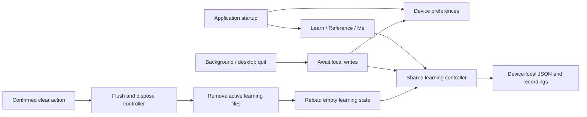

# Offline learning architecture

The Flutter shell opens Learn directly and exposes Learn / Reference / Me on every platform. AppScope creates device-local preferences, language, key profiles, audio/reference settings and one TrainingControllerHost. No account or transport is initialized.

The host shares one controller between learning, training settings, statistics and audio workbench. Learning files are atomic JSON stores under `morsecq/guest/training/`, with previous-save fallback. Managed recordings live under `morsecq/guest/media/recordings/`. App-wide appearance, language, decoder and reference settings remain in `settings.json`; physical-key profiles and desktop preferences are device-local.

Lifecycle transitions flush learning and preferences. Desktop quit awaits the same barrier, and iOS uses a short native background task for local writes. Clearing learning data suspends access, flushes pending writes, retires the old controller, removes only the active training/recording directories, and notifies the learning UI to open a new empty controller. App-wide preferences remain available.
