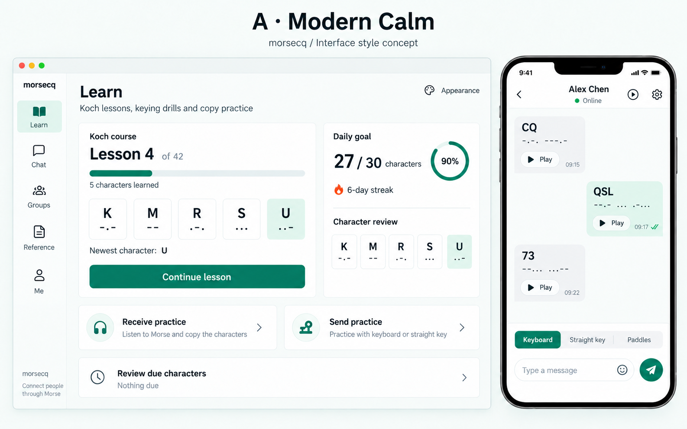
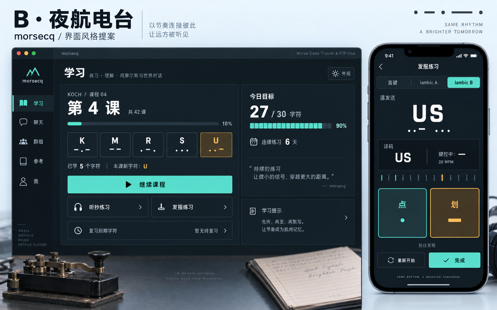
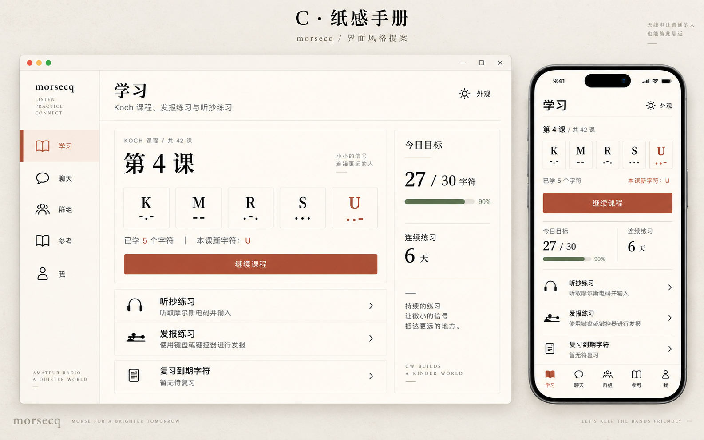
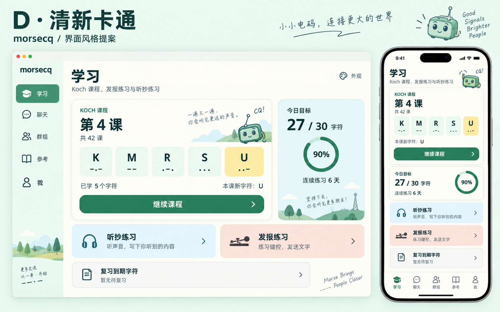
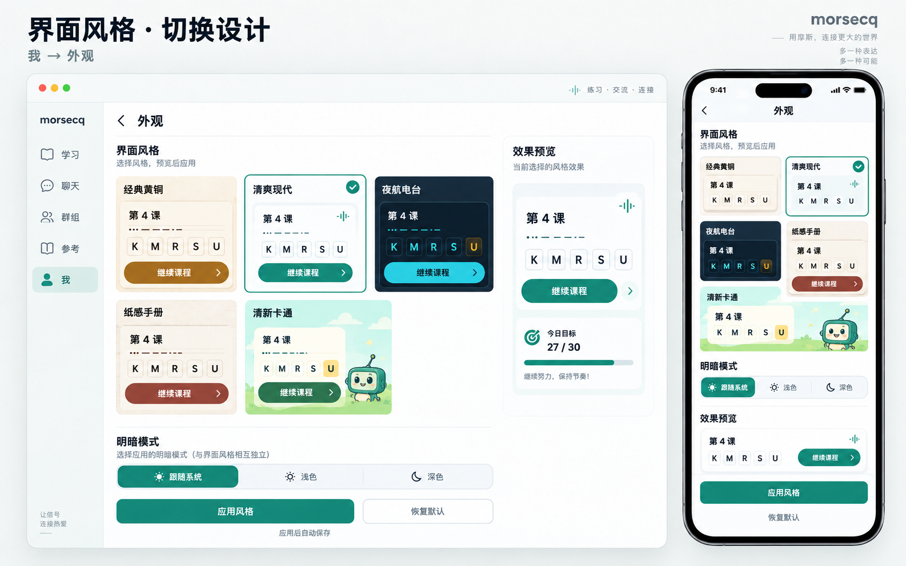
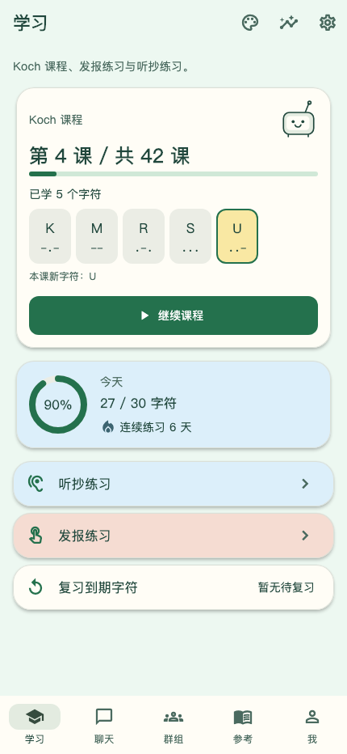

> Archived pre-split appearance concepts. The Learn / Chat / Groups / Reference / Me navigation illustrated below belongs to the former combined design and is not current MorseCQ navigation. Current offline MorseCQ uses Learn / Reference / Me; see the [2026-10-08 product concept](../product-2026-10-08/README.md) and [current README](../../../README.md).

[简体中文](./README.zh-CN.md)

# MorseCQ UI style proposals

Date: 2026-10-01. Status: the user approved all four additional styles. Commit the design artifacts separately and implement the application changes in a new worktree.

Based on the actual interfaces in `doc/screenshots/`, retain the five destinations: Learn, Chat, Groups, Reference, and Me. Add four styles and retain Classic Brass. Images were generated with the built-in image_gen tool; exact prompts are stored in `prompts.json`. These are visual concepts rather than screenshots of a running implementation.

| Option | Visual direction | Intended experience |
| --- | --- | --- |
| Classic Brass | Existing warm Material appearance | Retained as an optional style |
| A Modern Calm | White, teal, fine borders, distinct card hierarchy | Default for new users and Restore Defaults; product screenshots |
| B Night Radio | Navy charcoal, mint cyan, amber accents, instrument panels, monospace Morse | Focused practice and night use |
| C Paper Handbook | Paper white, terracotta, fine rules, rectangular editorial layout | Quiet reading, review, and reference |
| D Fresh Cartoon | Mint, cream yellow, pale blue and blush, soft corners, a small friendly radio character | A welcoming and relaxed learning experience |

## Visual concepts

## Switching experience

- Main entry: Me → Appearance. An optional desktop header shortcut opens the same page.
- Five style cards show miniature interfaces. Selection uses both an outline and a checkmark.
- Brightness is independent: System, Light, or Dark. Night Radio is illustrated in dark mode and the other concepts in light mode; both modes are planned for every style.
- Selecting a card updates the preview. Apply Style updates the application and saves the settings. Leaving without applying retains existing settings.
- Restore Defaults previews Modern Calm with System brightness; Apply Style confirms the reset.
- Preferences belong to the device and remain independent of training identity. Applying preserves the current destination, chat draft, course progress, playback, and keying state.
- Mobile uses a full appearance page with the complete preview before style cards and brightness; the apply action stays easy to reach.

## Shared interface constraints

- New styles arrange K, M, R, S, and U in one row so character lists do not fill the initial mobile viewport. Continue Course and practice entries take priority.
- 27 / 30 and 90% represent completion of the daily goal, not accuracy. Lesson 4 / 42 uses course progress.
- Morse uses readable monospace characters. Content, audio playback, and dot/dash controls take priority over decoration.
- Cartoon illustration is a small supporting element; no points, medals, levels, or other additional features are introduced.
- All styles share the five destinations, existing functionality, and input methods: touch keying on mobile and keyboard keying on desktop.
- Touch targets are at least 44 logical pixels. Chinese body text remains readable. Selection, online, playback, and pressed states use cues beyond color alone.
- Appearance transitions never delay key feedback or alter audio timing. Decorative animations stop when reduced motion is enabled.

## Confirmation

The user approved Modern Calm, Night Radio, Paper Handbook, and Fresh Cartoon, and requested a design-artifact commit followed by development in a new worktree. Modern Calm is now the default; Classic Brass and the other styles remain selectable, and saved choices are retained. English and Chinese README concepts use their corresponding language and the same Modern Calm style as product screenshots. This proposal does not replace the existing product plan.

## Rendered implementation previews

These frames render the actual Flutter widgets with the existing Chinese demo data at 1280 × 800 and 430 × 932 logical pixels. They use real local fonts and Material icons. Night Radio is shown dark; the other styles are shown light. They validate widget layout and visual hierarchy, rather than native device behavior.

| Style | Desktop | Phone |
| --- | --- | --- |
| Classic Brass | [Open](./implementation-previews/classic-desktop.png) | [Open](./implementation-previews/classic-phone.png) |
| Modern Calm | [Open](./implementation-previews/modern-desktop.png) | [Open](./implementation-previews/modern-phone.png) |
| Night Radio | [Open](./implementation-previews/radio-desktop.png) | [Open](./implementation-previews/radio-phone.png) |
| Paper Handbook | [Open](./implementation-previews/paper-desktop.png) | [Open](./implementation-previews/paper-phone.png) |
| Fresh Cartoon | [Open](./implementation-previews/cartoon-desktop.png) | [Open](./implementation-previews/cartoon-phone.png) |
| Appearance chooser | [Open](./implementation-previews/appearance-desktop.png) | [Open](./implementation-previews/appearance-phone.png) |

Recreate the frames from `apps/morsecq` with the opt-in `test/appearance/style_render_test.dart` test. Pass `MORSECQ_RENDER_STYLES=true`, an absolute `MORSECQ_STYLE_RENDER_DIR`, and `MORSECQ_PREVIEW_FONT` pointing to a Chinese font file through `--dart-define`. The test uses optional macOS monospace/serif fonts when present; regular test runs skip this export.

## Revision log

- 2026-10-01: Designed three additional styles and appearance settings from existing screenshots.
- 2026-10-01: Added Fresh Cartoon at the user's request and expanded the chooser to five styles.
- 2026-10-01: The user approved all four styles and requested development in an isolated worktree.
- 2026-10-01: Added actual desktop/phone Flutter previews for the five implemented styles and appearance chooser.
- 2026-10-01: Made Modern Calm the default and Restore Defaults style; localized its English README concept and aligned product screenshots with Modern Calm.
- 2026-10-01: Removed the top editorial titles, subtitles, and slogans from all six concept boards for product presentation. Preserved the product interfaces and corresponding README languages; retained exact edit prompts and constrained composition details in `prompts.json`. Updated the stacked appearance description to match the implemented preview-first layout.
